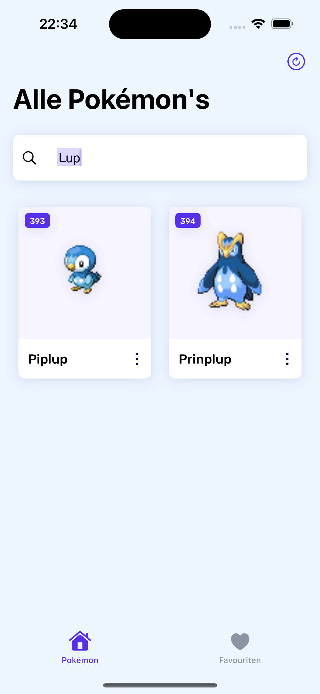

# Pokédex - iOS

"Pokédex - iOS" is an innovative mobile app developed for iOS using SwiftUI and Swift. It provides users with a captivating experience to explore the world of Pokémon by connecting to the PokeAPI. The app offers an array of features, including browsing and discovering Pokémon, capturing your favorites, and more.## Screenshots

## Screenshots

<table>
  <tr>
    <td align="center" width="33%">
       
      <em>All Pokemon Screen</em>
    </td>
    <td align="center" width="33%">
       
      <em>Liked Pokemon Screen</em>
    </td>
    <td align="center" width="33%">
       
      <em>Search Pokemon Screen</em>
    </td>
  </tr>
  <tr>
    <td align="center" width="33%">
       
      <em>Pokemon Details Screen | About</em>
    </td>
    <td align="center" width="33%">
       
      <em>Pokemon Details Screen | Stats</em>
    </td>
    <td align="center" width="33%">
       
      <em>Pokemon Details Screen | Evolution</em>
    </td>
  </tr>
</table>

## Features

### Tab Bar Navigation
- Effortless navigation through a user-friendly tab bar.
- Access to the following key pages:
  - Main Page
  - Favorites Page

### Main Page
- Explore a visually pleasing grid of Pokémon.
- Tap on Pokémon cells to delve into their details.
- Enjoy a stable UI with consistent sizing and smooth image loading.
- Instantly filter Pokémon with real-time search functionality.
- View essential Pokémon attributes, including images, names, and IDs.
- Optionally share Pokémon details with others.

### Detail Page
- Dive deep into comprehensive Pokémon details.
- Access vital information, including an image, name, types, and ID/number.
- Easily mark or unmark Pokémon as favorites with a persistent favorite icon.
- Optional access to bottom segments for more in-depth insights (About, Stats, Evolutions).
- Seamlessly load additional details while showcasing known information.
- Adapt to various iPhone screen sizes with scrollable content.

### Favorites Page
- Exclusive display of your favorited Pokémon.
- Utilizes the same data source as the main page, filtered for favorites.
- Consistent experience: Tapping a Pokémon opens the same detail page as the main page.
- Clear messaging when there are no favorited Pokémon.
- Persistent favorites across app sessions, thanks to UserDefaults.

### Extra Features
- Dive deeper into Pokémon lore with fully implemented bottom segments (About, Stats, Evolutions).
- Share your favorite Pokémon with friends using iOS sharing functionality.
- Reach a broader audience by localizing the app for different languages (even via Google Translate).
- Personalize your app's identity with a custom app icon.
- Stay up-to-date with pull-to-refresh for data updates.
- Seamlessly load more Pokémon as you scroll to the end of the list with pagination.

